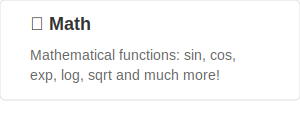
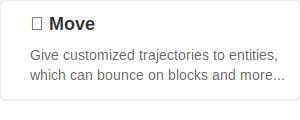
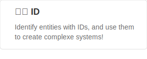
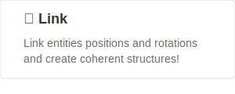
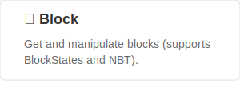
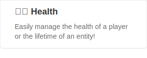

  <picture>
    <source media="(prefers-color-scheme: dark)" alt="Bookshelf" srcset="../images/banner-dark.png" width="600px">
    
  </picture>

# 🕵️‍♂️ What is Bookshelf?
Bookshelf (formerly known as Gunivers Libs) is a user-friendly modular library datapack, crafted to assist mapmakers in effortlessly implementing intricate systems within their maps.

    <a href="https://docs.mcbookshelf.dev/en/latest/quickstart.html">
      <picture>
        <source alt="quickstart" srcset="../images/quickstart.svg" width="140px">
        
      </picture>
    </a>
    &nbsp;
    <a href="https://www.youtube.com/watch?v=E2nKYEvjETk">
      <picture>
        <source alt="watch-trailer" srcset="../images/watch-trailer.svg" width="140px">
        
      </picture>
    </a>

# 🕵️‍♂️ Featured modules

    <picture>
        <source media="(prefers-color-scheme: dark)" alt="math" srcset="../images/math-dark.svg">
        
    </picture>
  &nbsp;
    <picture>
        <source media="(prefers-color-scheme: dark)" alt="move" srcset="../images/move-dark.svg">
        
    </picture>
  &nbsp;
    <picture>
        <source media="(prefers-color-scheme: dark)" alt="id" srcset="../images/id-dark.svg">
        
    </picture>
  &nbsp;
    <picture>
        <source media="(prefers-color-scheme: dark)" alt="link" srcset="../images/link-dark.svg">
        
    </picture>
  &nbsp;
    <picture>
        <source media="(prefers-color-scheme: dark)" alt="block" srcset="../images/block-dark.svg">
        
    </picture>
  &nbsp;
    <picture>
        <source media="(prefers-color-scheme: dark)" alt="health" srcset="../images/health-dark.svg">
        
    </picture>

    
And much more!

# 🔥 Motivation
As developers, we recognize the importance of using libraries to save time and avoid reinventing the wheel. Unfortunately, we’ve noticed that mapmakers within the Minecraft community are often unfamiliar with this concept.

That’s why we started this project, to introduce a variety of reusable tools and try to convice mapmakers to embrace the use of libraries.

While we strive to keep these modules as much optimized and accurate as possible, our main goal is to offer a wide range of features and provide tools that are both easy to use and install. Therefore, we will always prioritize accessibility above everything else.

> “I have seen further than others because I have stood on the shoulders of giants.”  
> -- Isaac Newton

# 🤝 Contribution
If you have any doubts related to the project or want to discuss something, then join [our Discord](https://discord.gg/MkXytNjmBt) server.

If you want to contribute, please refer to the [contribution docs](https://docs.bookshelf.dev/en/latest/contribute/index.html) for more information.

